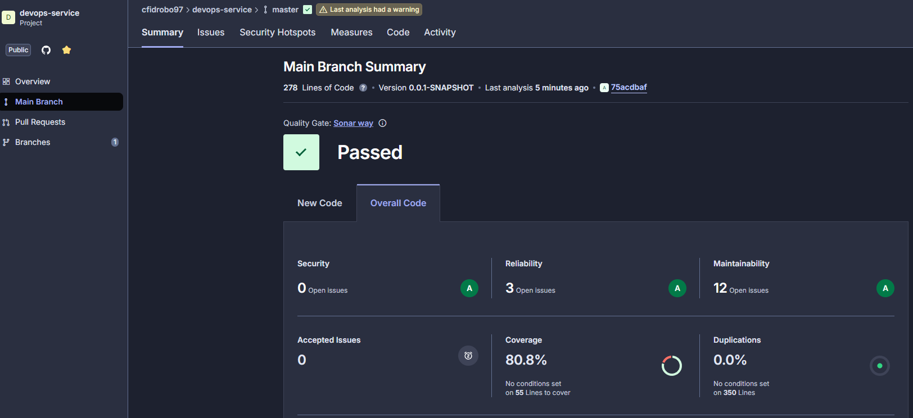
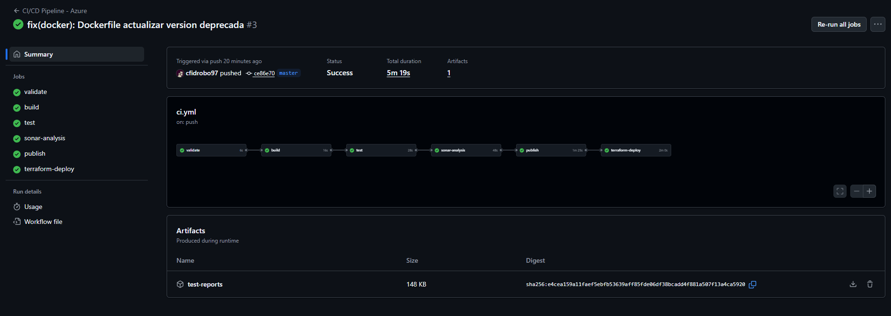
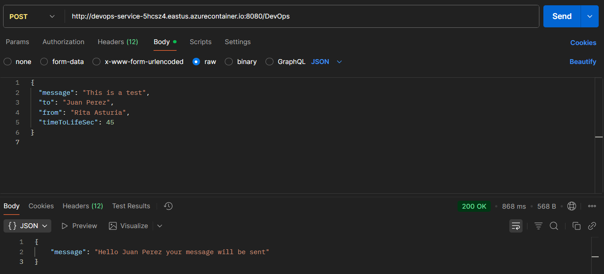

# PRUEBA DevOps - Tata Consultancy Services
## Cristian Fernando Idrobo Montalvo

---

## Introducción

Este proyecto implementa un microservicio REST en **Java + Spring Boot** con un endpoint `/DevOps` asegurado mediante **API Key** y **JWT único por transacción**, dockerizado y desplegado en **Azure Container Instances (ACI)** utilizando **Terraform**. La entrega incluye un **pipeline CI/CD completo** en **GitHub Actions** con integración de SonarCloud para análisis de calidad de código.

### Características principales:
- Autenticación dual: API Key + JWT único por transacción
- Prevención de replay attacks mediante validación de JWT
- Dockerización con imágenes en GitHub Container Registry (GHCR)
- Infraestructura como código (IaC) con Terraform
- Despliegue automatizado en Azure Container Instances
- Pipeline CI/CD con 5 etapas: Build, Test, SonarCloud, Publish, Deploy
- Backend remoto de Terraform en Azure Storage para persistencia de estado

---

## Credenciales de Prueba

| Clave                          | Valor                                                                 |
|--------------------------------|-----------------------------------------------------------------------|
| **API Key (Fija)**             | `2f5ae96c-b558-4c7b-a590-a501ae1c3f6c`                                |
| **JWT**                        | **Debe generarse único para cada petición** (ver comandos abajo)     |
| **URL del Servicio**           | `http://devops-service-5hcsz4.eastus.azurecontainer.io:8080`         |
| **Endpoint**                   | `POST /DevOps`                                                        |

> El JWT debe ser único por cada transacción

---

## Lógica del Proyecto

### Flujo de Autenticación y Procesamiento

El flujo de una petición sigue estos pasos:

1. **Cliente**: 
   - Genera JWT único (UUID/GUID)
   - Envía petición con API Key en header y JWT

2. **Capa de Seguridad (ApiKeyFilter)**:
   - Valida API Key en header `X-Parse-REST-API-Key`
   - Rechaza peticiones con API Key inválida (401 Unauthorized)

3. **Capa de Negocio (DevOpsController)**:
   - Valida que JWT sea único (no reutilizado)
   - Valida campos obligatorios del body
   - Procesa mensaje
   - Genera nuevo JWT para respuesta

4. **Respuesta**:
   - Status 200 OK
   - Mensaje de confirmación
   - JWT de respuesta en header

### Componentes Clave

**ApiKeyFilter** (`ApiKeyFilter.java`)
- Filtro de seguridad que intercepta todas las peticiones
- Valida la presencia del header `X-Parse-REST-API-Key`
- Rechaza peticiones sin API Key válida

**JwtTrackerService** (`JwtTrackerService.java`)
- Mantiene registro de JWTs utilizados
- Previene ataques de replay
- Garantiza unicidad de transacciones

**DevOpsController** (`DevOpsController.java`)
- Endpoint principal `POST /DevOps`
- Valida JWT único y campos obligatorios
- Genera JWT de respuesta
- Retorna error 405 para métodos no permitidos

**JwtUtil** (`JwtUtil.java`)
- Genera tokens JWT firmados con HMAC-SHA256
- Incluye claims personalizados
- Configurable mediante properties

---

## Configuración de Variables de Entorno

### Linux / macOS (Bash)

```bash
# Exportar variables de entorno
export API_KEY="2f5ae96c-b558-4c7b-a590-a501ae1c3f6c"
export HOST="devops-service-5hcsz4.eastus.azurecontainer.io:8080"

# Generar JWT único para esta transacción
export JWT=$(uuidgen)

# Verificar variables
echo "API Key: $API_KEY"
echo "Host: $HOST"
echo "JWT generado: $JWT"
```

### Windows (PowerShell)

```powershell
# Exportar variables de entorno
$env:API_KEY = "2f5ae96c-b558-4c7b-a590-a501ae1c3f6c"
$env:HOST = "devops-service-5hcsz4.eastus.azurecontainer.io:8080"

# Generar JWT único para esta transacción
$env:JWT = [guid]::NewGuid().ToString()

# Verificar variables
Write-Host "API Key: $env:API_KEY"
Write-Host "Host: $env:HOST"
Write-Host "JWT generado: $env:JWT"
```

---

## Probar el Endpoint

### Método 1: Linux / macOS (curl)

#### Generar JWT único y ejecutar petición:

```bash
# Generar JWT único
export JWT=$(uuidgen)

# Ejecutar petición
curl -X POST \
  -H "X-Parse-REST-API-Key: 2f5ae96c-b558-4c7b-a590-a501ae1c3f6c" \
  -H "X-JWT-KWY: ${JWT}" \
  -H "Content-Type: application/json" \
  -d '{ "message": "This is a test", "to": "Juan Perez", "from": "Rita Asturia", "timeToLifeSec": 45 }' \
  http://${HOST}/DevOps
```

#### Respuesta esperada:

```json
{
  "message": "Hello Juan Perez your message will be sent"
}
```

### Método 2: Windows (PowerShell)

#### Generar JWT único y ejecutar petición:

```powershell
# Generar JWT único
$JWT = [guid]::NewGuid().ToString()

# Ejecutar petición
Invoke-RestMethod `
  -Method POST `
  -Uri "http://${env:HOST}/DevOps" `
  -Headers @{
    "X-Parse-REST-API-Key" = $env:API_KEY
    "X-JWT-KWY"            = $JWT
    "Content-Type"         = "application/json"
  } `
  -Body '{"message":"This is a test","to":"Juan Perez","from":"Rita Asturia","timeToLifeSec":45}'
```


---

## Pipeline CI/CD con GitHub Actions y Azure

El pipeline se ejecuta automáticamente en cada **push** a las ramas `master` y `dev`, así como en tags con formato `v*` (ej: `v1.0.0`).

### Arquitectura del Pipeline

El pipeline consta de 5 stages que se ejecutan secuencialmente:

**Stage 0: Validate**
- Valida pertenencia de commits/tags a rama master
- Determina si la ejecución debe desplegar a producción
- Define variable `should_deploy` (true para master/tags, false para dev)

**Stage 1: Build**
- Configuración de JDK 17 con Maven
- Resolución de dependencias del proyecto
- Compilación del código fuente
- Duración aproximada: 30-45 segundos

**Stage 2: Test**
- Ejecución de tests unitarios con JUnit 5
- Generación de reporte de cobertura con JaCoCo
- Upload de artifacts (reportes de tests y cobertura)
- Total de 13 tests ejecutados
- Duración aproximada: 40-60 segundos

**Stage 3: SonarCloud Analysis**
- Análisis estático de código para detectar bugs, vulnerabilities y code smells
- Métricas de cobertura de tests
- Análisis de duplicaciones y mantenibilidad
- Integración con dashboard de SonarCloud



**Métricas analizadas:**
- Bugs y vulnerabilities
- Code smells
- Coverage (líneas y ramas)
- Duplications
- Maintainability rating

**Stage 4: Publish (Docker)**
- Condicional: solo ejecuta si `should_deploy == true`
- Build de imagen Docker multi-stage
- Login a GitHub Container Registry (GHCR)
- Tagging estratégico de imágenes (SHA corto + latest + versión)
- Push de imágenes a GHCR
- Duración aproximada: 2-3 minutos

**Stage 5: Terraform Deploy (Azure)**
- Condicional: solo ejecuta si `should_deploy == true`
- Autenticación en Azure con Service Principal
- Preparación de backend remoto (Storage Account para estado)
- Inicialización y validación de Terraform
- Despliegue de Azure Container Instance
- Output de URL pública del servicio
- Duración aproximada: 3-5 minutos

### Secrets de GitHub Actions Necesarios

| Secret                | Descripción                                      |
|-----------------------|--------------------------------------------------|
| `AZURE_CREDENTIALS`   | JSON con credenciales del Service Principal      |
| `GHCR_PAT`            | Personal Access Token para GitHub Container Registry |
| `SONAR_TOKEN`         | Token de autenticación de SonarCloud             |
| `SONAR_ORG`           | Organización de SonarCloud                       |
| `SONAR_PROJECT_KEY`   | Clave del proyecto                               | 

---
### Resultados del Análisis Github Actions


---
## Integración con Azure Cloud

### Arquitectura de Deployment

El proyecto utiliza Azure Container Instances para el hosting de la aplicación:

**Componentes de Azure:**
- **Resource Group**: `devops-service-rg` (Region: East US)
- **Storage Account**: `tfstatedevops97` (Backend de Terraform)
  - Container: `tfstate`
  - File: `prod.terraform.tfstate`
- **Container Instance**: `devops-service-aci`
  - Image: `ghcr.io/cfidrobo97/prueba_devops_tata:latest`
  - DNS: `devops-service-[random].eastus.azurecontainer.io`
  - Port: 8080 (Public)
  - CPU: 1 core
  - Memory: 1.5 GB
  - Restart Policy: Always

**Flujo de Deployment:**
1. GitHub Actions ejecuta pipeline
2. Docker build y push a GHCR
3. Terraform se autentica en Azure
4. Terraform lee/actualiza estado desde Storage Account
5. Terraform crea/actualiza Container Instance
6. Aplicación disponible en URL pública

**Ventajas de Azure Container Instances:**
- Serverless: sin gestión de VMs
- Facturación por segundo
- Despliegue rápido (segundos)
- DNS público automático
- Escalabilidad bajo demanda
- Integración nativa con Terraform

**Backend Remoto de Terraform:**
- Estado persistente entre ejecuciones del pipeline
- Prevención de duplicación de recursos
- Colaboración en equipo
- State locking para concurrencia

---
### Pruebas con Postman

---

## Tecnologías Utilizadas

**Backend:**
- Java 
- Spring Boot
- Spring Security
- JWT 
- Maven

**Testing:**
- JUnit 
- Mockito
- Spring MockMvc
- JaCoCo 

**DevOps & Cloud:**
- Docker
- GitHub Actions
- Terraform 
- Azure Container Instances
- Azure Storage
- GitHub Container Registry

**Code Quality:**
- SonarCloud
- SpotBugs

---
## Enlaces
- Repositorio: https://github.com/cfidrobo97/Prueba_DevOps_TATA

- Github Actions: https://github.com/cfidrobo97/Prueba_DevOps_TATA/actions

- Dashboard Sonarcloud: https://sonarcloud.io/project/overview?id=cfidrobo97_Prueba_DevOps_TATA

---